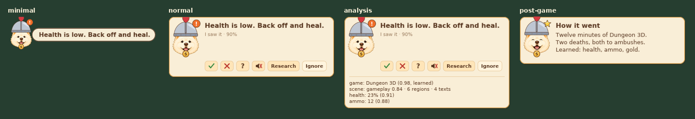
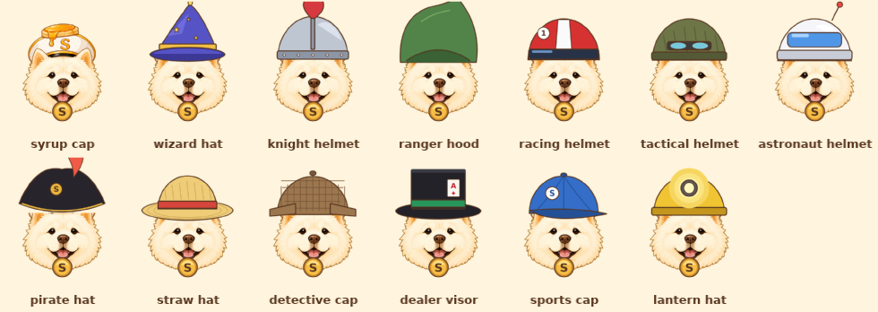

# Syrup Universal

**Syrup learns the game with you.** Syrup is a companion that watches whatever
game you're playing. It works out what's on the screen, learns the game and
you, looks up what it doesn't know, and coaches in short sentences. It only
looks and talks. It doesn't read memory, inject code, hook anything or send
input.



Syrup is the Maplesyrup dog, and it keeps its **S** whatever it wears. Each
game gets a hat: the catalog or a plugin picks it, or the game's genres do
once research finds them. MapleStory keeps the original syrup cap.



## What it does

- **Watches any game**, live on Windows (a game window or the whole screen),
  on an iPhone (the [phone app](docs/iphone.md) shows its screen to Syrup
  running on your computer or a server, and speaks for it), or from a
  recording on any system (a video, a folder of screenshots). It also runs
  three synthetic games whose exact ground truth is known.
- **Works out the screen without knowing the game.** Whatever stays still
  while the game moves is interface. Bars get their fill measured, text is
  read, and minimaps, panels and dialogs are recognised. It also tells which
  screen is up (play, menu, loading, dialogue, cutscene, defeat, victory).
  Perception never says "HP". It reports what it saw, in one
  [intermediate representation](docs/protocols/observation.md).
- **Learns what things are**: this red bar is health (it's labelled "HP", it
  falls in fights, it was empty at the death screen). This number ticks down
  once a second, so it's a timer. The player can correct any of it. It learns
  deaths, wins, level-ups and objectives too.
- **Recognises the game** from its window, executable, Steam folder, words on
  screen, the look of its interface, or the player saying so. Below a
  confidence bar it answers "not sure yet". A game nobody catalogued still
  gets a profile and can be named later.
- **Remembers**: a profile per game (its interface, words, version, genres,
  hat), a knowledge graph, moments worth remembering, a player model with how
  sure it is of each skill, and every session's timeline. It's all plain JSON
  on this computer, and `syrup forget` deletes any of it.
- **Researches** in the background: Wikipedia, the game's wiki, Steam store
  data and patch news. Every fact keeps its source, date, game version,
  confidence and kind (fact, current patch, community consensus,
  speculation, or Syrup's own inference). Advice from an older patch is
  flagged, and spoilers are held back unless you ask for them.
- **Coaches sparingly.** Most moments get no advice. An interruption policy
  weighs how urgent a line is, how busy you are, when Syrup last spoke, and
  what you told it about similar lines. One click on 👍 👎 ❓ 🔇 changes what
  it says next time.
- **Shows its work.** `--devtools` serves a local page with the frame and
  everything perception found on it, the game and why, each concept with its
  evidence, the advice with what was held back and why, the player model,
  the knowledge with sources, the profile (correctable), and every event.

## Try it

You need Rust 1.95 or newer. Live capture, the overlay window, the voice and
Windows' OCR need Windows 10 (2004) or later. Replays and simulations run
anywhere; video replays need `ffmpeg`, and reading text outside Windows needs
`tesseract`.

```sh
cargo build --release          # target/release/syrup and syrup-testgame

# A synthetic game in a real window, and Syrup watching it live (Windows):
syrup-testgame dungeon &
syrup live --window "Dungeon 3D" --devtools        # http://127.0.0.1:7777

# Your game: the window in front, or name it.
syrup live
syrup live --exe MapleStory.exe --spoilers hints_only --mode minimal

# A recording (a screen recording's taskbar is found and cut off):
syrup replay my-session.mp4 --explain --devtools

# A synthetic game, measured against its truth:
syrup simulate scroller --seconds 120 --truth

# The brain for the iPhone app (docs/iphone.md):
syrup serve --port 8080

# Research, memory:
syrup research "Hollow Knight" --topic Hornet
syrup profiles
syrup forget "Hollow Knight"
```

`syrup live` stops when you press Enter. It then shows the post-game card for
a few seconds and saves everything. `syrup <command> --help` lists every
option.

## How it works

Every frame goes through the same pipeline:

```
capture → sample → perceive → (plugin) → recognise → state → profile → player model
                                                                  ↘ knowledge (async research)
                                                                    → coach → overlay + voice
```

Every step publishes events on one bus, which the session timeline and the
devtools page read. The realtime loop never waits on the network, and reading
text can run off the loop too. See [docs/architecture/overview.md](docs/architecture/overview.md),
and [docs/architecture/maplesyrup-reuse.md](docs/architecture/maplesyrup-reuse.md)
for what came from Maplesyrup.

| | |
|---|---|
| [docs/product/experience.md](docs/product/experience.md) | what the player sees and hears, session by session |
| [docs/protocols/](docs/protocols/) | events, the observation IR, the profile and memory files, the devtools API |
| [docs/plugins/writing-a-plugin.md](docs/plugins/writing-a-plugin.md) | a plugin in JSON, or in Rust |
| [docs/decisions.md](docs/decisions.md) | the choices made and why |
| [docs/evaluation.md](docs/evaluation.md) | measured results: synthetic games, a real recording, CI |
| [docs/iphone.md](docs/iphone.md) | the iPhone app: its eyes, its mouth, and the brain on your computer; setting it up |

## What it never does

Syrup reads pixels and says things. It doesn't read or write a game's
memory, inject code, hook the renderer, touch network traffic, use private
game APIs, or send input to the game. No automated aiming, combat or
movement exists anywhere in the codebase. The Windows features each crate
links are listed in its `Cargo.toml`, and none of them sends input. The
overlay keeps itself out of screen captures, so Syrup never reads its own
card.

## Privacy

What Syrup learns stays in its data folder (`%APPDATA%\SyrupUniversal`,
`~/Library/Application Support/SyrupUniversal`,
`~/.local/share/syrup-universal`, or `--data-dir`). Frames are saved only
with `--record`, and only under `recordings/`. With research on, only search
terms leave the computer (a game's title, a boss's name). With `--no-research`,
nothing does.

## Status

This is the MVP. It is verified on three very different synthetic games
(scores in [docs/evaluation.md](docs/evaluation.md)), in CI on Linux, Windows
and macOS, and in a live Windows run in CI where a test game in a real window
is watched, learned and remembered. It was also evaluated locally on a real
MapleStory recording; the numbers are written down, the footage isn't
committed. It has not yet been played with at length on real games: expect
the heuristics to need tuning per genre, and use the player corrections and
the devtools page for that.

## Repository

```
crates/syrup-core         shared vocabulary: geometry, confidence, the observation IR, state,
                          profiles, knowledge, advice, events and the event bus
crates/syrup-capture      frame sources: game window / screen (Windows), video, images, taskbar crop
crates/syrup-perception   sampling, stability, bars, text (Windows OCR / Tesseract), regions, scenes
crates/syrup-state        concepts from elements: values, trends, transitions, what is what
crates/syrup-recognition  which game is this; the catalog
crates/syrup-memory       profiles, episodes, the player, session timelines; learning profiles
crates/syrup-knowledge    the knowledge graph and the research agent
crates/syrup-player       the player model
crates/syrup-coach        advice rules, interruption and spoiler policies, feedback
crates/syrup-paint        a small software painter and embedded fonts
crates/syrup-avatar       Syrup, its hats and faces
crates/syrup-ui           the overlay (painted; a layered window on Windows) and the voice
crates/syrup-plugins      the plugin trait, JSON plugins, MapleStory
crates/syrup-runtime      the pipeline, the frame loop, the devtools server
crates/syrup-testgames    three synthetic games with ground truth, and their scorer
apps/desktop              the `syrup` program and `syrup-testgame`
apps/devtools             the devtools page (TypeScript; dist/ is served by syrup)
plugins/                  data plugins (plugin.json)
tests/                    end-to-end tests: three games, two sessions each
tools/                    asset generators (fonts, Syrup's art, research fixtures), CI helpers
third_party/syrup         the syrup vision library (a submodule)
```

`cargo test --workspace` runs everything, including the three-game
end-to-end test (about 4 minutes with Tesseract). After editing
`apps/devtools/src/app.ts`, run `tsc -p apps/devtools/tsconfig.json` and
commit `dist/` (CI checks it's current).

## License

MIT. Syrup's art is derived from Maplesyrup's companion (see
`tools/make_syrup_art.py`). The fonts are DejaVu (`assets/syrup/fonts/LICENSE-DejaVu.txt`).
